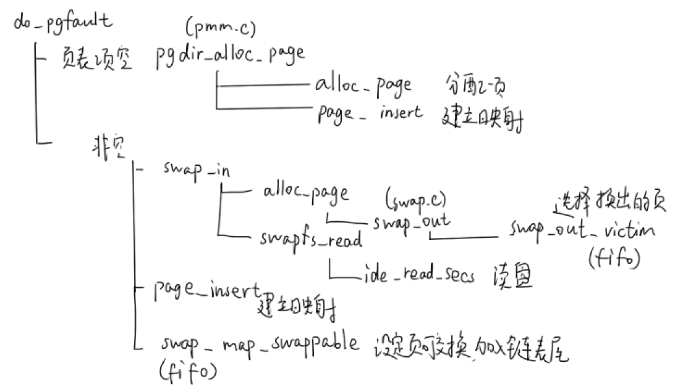

### lab3 虚拟内存管理

#### 练习1：给未被映射的地址映射上物理页

lab2实现了内存分配和回收，建立了二级页表，但尚未进行二级页表项到物理页的映射

##### vma,mm,Page

vma：一块连续的虚拟地址空间

- vm_flags：标志位，标记该虚拟空间内的虚拟页是否只读、可读写、可执行

```c
// the virtual continuous memory area(vma)
struct vma_struct {
    struct mm_struct *vm_mm; // the set of vma using the same PDT 
    uintptr_t vm_start;      //    start addr of vma    
    uintptr_t vm_end;        // end addr of vma
    uint32_t vm_flags;       // flags of vma
    list_entry_t list_link;  // linear list link which sorted by start addr of vma
};
```

mm_struct：管理所有属于同一页目录的vma

- mmap_list链表，链接了所有属于同一页目录的vma
- sm_priv：指向用来记录页访问情况的链表头

```c
// the control struct for a set of vma using the same PDT
struct mm_struct {
    list_entry_t mmap_list;        // linear list link which sorted by start addr of vma
    struct vma_struct *mmap_cache; // current accessed vma, used for speed purpose
    pde_t *pgdir;                  // the PDT of these vma
    int map_count;                 // the count of these vma
    void *sm_priv;                   // the private data for swap manager
};
```

Page结构体（memlayout.h）在lab3中新增了两个成员

- pra_page_link：该物理页在**用于页面置换的链表**中的节点
- pra_vaddr：该物理页对应的虚拟地址。该成员在swap_out()中使用

```c
struct Page {
    int ref;                        // page frame's reference counter
    uint32_t flags;                 // array of flags that describe the status of the page frame
    unsigned int property;          // the num of free block, used in first fit pm manager
    list_entry_t page_link;         // free list link
    list_entry_t pra_page_link;     // used for pra (page replace algorithm)
    uintptr_t pra_vaddr;            // used for pra (page replace algorithm)
};
```

##### do_pgfault处理缺页

什么是缺页：CPU根据指令使用各种寻址方式得到虚拟地址，然后几经周折找到页表项，如果页表项非空并且有效位为1，表明要读的数据就在内存的物理页中。发生缺页有两种情况：

1. 页表项为空，根本没有进行物理页的映射，于是分配一个物理页建立映射，再将磁盘数据读入物理页就好
2. 页表项非空，有效位为0，表明存在映射，但是该物理页已经被换出了，需要重新选一个物理页进行映射


首先展示vmm.c/do_pgfault()**函数调用结图**（超级重要！！！）

可以看到不同页面置换算法，对于页面的换入和换出有不同的实现方法，**主要是实现swap_map_swappable()和swap_out_victim()两个函数**。特别地，swap_out_victim()嵌套在alloc_page()中，每当要分配物理页就会调用



page fault处理办法：

- 首先将虚拟地址addr定位到一个虚拟空间vma，一个vma内所有页的访问权限是一致的
- 检查错误码，判断这次内存访问为读/写，对应的物理页是否存在，结合查找到的该线性地址的虚拟页是否允许读写，来判断是否是读写权限导致的错误。否则就是缺页
- 去找页表项ptep，如果为空，则用pgdir_alloc_page分配物理页，并将物理页地址填入页表项，建立映射
- 如果页表项不为空，则表示该页已经被换出过（有效位为0），所以需要重新选择一个物理页（需要使用页面置换算法来选择换出的页），并将数据从磁盘写入该页，并重新建立映射
  - swap_in()：选择换出的页，从磁盘读进数据
  - page_insert()：将物理页地址填入页表项，建立映射
  - swap_map_swappable()：设置该物理页可交换，对于FIFO算法就是加到链表的末尾

```c
//访问虚拟地址addr时发生缺页故障，进行处理
int
do_pgfault(struct mm_struct *mm, uint32_t error_code, uintptr_t addr) {
    int ret = -E_INVAL;
    //try to find a vma which include addr
    struct vma_struct *vma = find_vma(mm, addr);//找到addr所属的vma

    pgfault_num++;
    //If the addr is in the range of a mm's vma?
    if (vma == NULL || vma->vm_start > addr) {
        cprintf("not valid addr %x, and  can not find it in vma\n", addr);
        goto failed;
    }
    //check the error_code
    switch (error_code & 3) {
    default:
            /* error code flag : default is 3 ( W/R=1, P=1): write, present */
    case 2: /* error code flag : (W/R=1, P=0): write, not present */
        if (!(vma->vm_flags & VM_WRITE)) {
            cprintf("do_pgfault failed: error code flag = write AND not present, but the addr's vma cannot write\n");
            goto failed;
        }
        break;
    case 1: /* error code flag : (W/R=0, P=1): read, present */
        cprintf("do_pgfault failed: error code flag = read AND present\n");
        goto failed;
    case 0: /* error code flag : (W/R=0, P=0): read, not present */
        if (!(vma->vm_flags & (VM_READ | VM_EXEC))) {
            cprintf("do_pgfault failed: error code flag = read AND not present, but the addr's vma cannot read or exec\n");
            goto failed;
        }
    }
    uint32_t perm = PTE_U;
    if (vma->vm_flags & VM_WRITE) {
        perm |= PTE_W;
    }
    addr = ROUNDDOWN(addr, PGSIZE);

    ret = -E_NO_MEM;

    
    
    
    pte_t *ptep=NULL;
    // try to find a pte, if pte's PT(Page Table) isn't existed, then create a PT.
    // (notice the 3th parameter '1')
    if ((ptep = get_pte(mm->pgdir, addr, 1)) == NULL) {//找到页表项
        cprintf("get_pte in do_pgfault failed\n");
        goto failed;
    }
    //页表项为空
    if (*ptep == 0) { // if the phy addr isn't exist, then alloc a page & map the phy addr with logical addr
        //分配物理页，并将物理页地址填入页表项
        if (pgdir_alloc_page(mm->pgdir, addr, perm) == NULL) {
            cprintf("pgdir_alloc_page in do_pgfault failed\n");
            goto failed;
        }
    }
    //页表项非空
    else { // if this pte is a swap entry, then load data from disk to a page with phy addr
           // and call page_insert to map the phy addr with logical addr
        if(swap_init_ok) {
            struct Page *page=NULL;
            if ((ret = swap_in(mm, addr, &page)) != 0) {//读磁盘到物理页
                cprintf("swap_in in do_pgfault failed\n");
                goto failed;
            }    
            page_insert(mm->pgdir, page, addr, perm);//将物理页地址填入页表项
            swap_map_swappable(mm, addr, page, 1);//设置该页可交换
            page->pra_vaddr=addr;//page的虚拟地址
        }
        else {
            cprintf("no swap_init_ok but ptep is %x, failed\n",*ptep);
            goto failed;
        }
   }
   ret = 0;
failed:
    return ret;
}
```

#### 练习2：补充完成基于FIFO的页面替换算法

FIFO页替换算法：先进先出，总是淘汰最先进入内存的页，即选择在内存中驻留时间最久的页予以淘汰。使用一个链式队列实现

_fifo_map_swappable()函数是练习1中所说swap_map_swappable()函数的一种，即采用FIFO替换算法实现物理页的换入。只要是新换入的页就加入链表表尾

swap_fifo.c

```c
 //换入页
static int
_fifo_map_swappable(struct mm_struct *mm, uintptr_t addr, struct Page *page, int swap_in)
{
    list_entry_t *head=(list_entry_t*) mm->sm_priv;//用于页面置换的链表的表头
    list_entry_t *entry=&(page->pra_page_link);//page在用于页面置换的链表中的节点
 
    assert(entry != NULL && head != NULL);
    //record the page access situlation
    /*LAB3 EXERCISE 2: YOUR CODE*/ 
    //(1)link the most recent arrival page at the back of the pra_list_head qeueue.
    list_add(head, entry);//将page节点添加到链表末尾
    return 0;
}
```

_fifo_swap_out_victim()采用FIFO替换算法选择物理页进行换出，选择链表头部弹出

```c
 //换出页
static int
_fifo_swap_out_victim(struct mm_struct *mm, struct Page ** ptr_page, int in_tick)
{
     list_entry_t *head=(list_entry_t*) mm->sm_priv;//用于页面置换的链表的表头
         assert(head != NULL);
     assert(in_tick==0);
     /* Select the victim */
     /*LAB3 EXERCISE 2: YOUR CODE*/ 
     //(1)  unlink the  earliest arrival page in front of pra_list_head qeueue
     //(2)  set the addr of addr of this page to ptr_page
     /* Select the tail */
     list_entry_t *le = head->prev;//链表头
     assert(head!=le);
     struct Page *p = le2page(le, pra_page_link);
     list_del(le);//从链表中删除该节点
     assert(p !=NULL);
     *ptr_page = p;
     return 0;
}
```

#### 扩展练习：实现识别dirty bit的extended clock页替换算法

时钟页替换算法（CLOCK）：用一个循环链表连接所有物理页，每个页表项设定一个**访问位**，若该页被访问过就置访问位为1。当需要找页换出时，遍历循环链表，若访问位=0则换出，若访问位=1则置为0，再判断下一页

改进的CLOCK算法（Extended CLOCK）：每个页表项设置两个位（访问位u，修改位m），最多进行四轮扫描：

- 第一轮：找（0,0）用于置换，失败进入第二轮
- 第二轮：找（0,1）用于置换。所有扫描过的帧的访问位u设为0，即(1,0)变为(0,0), (1,1)变为(0,1)。失败进入第三轮
- 第三轮：找（0,0）用于置换。失败进入第四轮
- 第四轮：找（0,1）用于置换
- 因此页面淘汰顺序是(0,0)->(0,1)->(1,0)->(1,1)，先淘汰没访问过的，再淘汰访问过没修改过的，最后淘汰访问过修改过的

先给Page结构体增加一个成员变量clock_flags，第1位是访问位，第0位是修改位

```c
static int 
_clock_map_swappable(struct mm_struct *mm, uintptr_t addr, struct Page *page, int swap_in){
    list_entry_t *head=(list_entry_t*) mm->sm_priv;
    list_entry_t *entry=&(page->pra_page_link);
    assert(entry != NULL && head != NULL);

    list_add(head,entry);
    page->clock_flags=0b11;//访问位=修改位=1
    return 0;
}

static int
_clock_swap_out_victim(struct mm_struct *mm, struct Page ** ptr_page, int in_tick)
{
    list_entry_t *head=(list_entry_t*) mm->sm_priv;//用于页面置换的链表的表头
    assert(head != NULL);
    assert(in_tick==0);
    list_entry_t *le=head;
    while(1){
        if(le==&pra_list_head){//头结点不包含page，跳过
            le=list_prev(le);
        }
        struct Page *page=le2page(le,pra_page_link);
        if((page->clock_flags&2)==2){//访问位为1，10或11
            page->clock_flags-=2;
        }
        else if(page->clock_flags==0b01){//01
            page->clock_flags=0;
        }
        else{//00，换出
            *ptr_page=page;
            mm->sm_priv=list_prev(le);
            list_del(le);
            break;
        }
        le=list_prev(le);
    }
    return 0;
}
```

