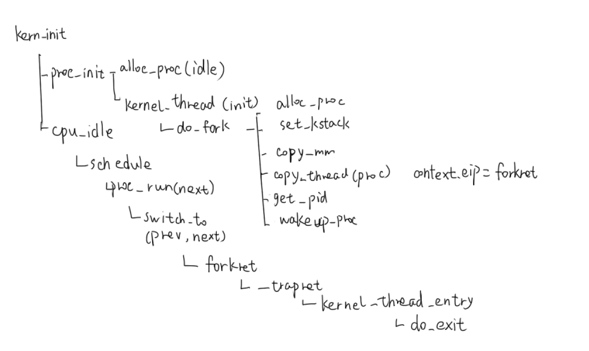

### lab4 内核线程管理

内核线程和用户进程的区别

- 内核线程只运行在内核态，用户进程在用户态、内核态之间交替运行
- 所有内核线程共用内核内存空间，用户进程有自己的用户内存空间

每个内核线程都有一个线程控制块，通过链表连接，再通过调度器调度CPU执行


#### 练习**1**：分配并初始化一个进程控制块

进程控制块proc_struct结构

其中每个进程控制块会被加入到两个链表，一个是普通的进程链表list_link，另一个是哈希链表hash_link，可以使用find_proc()函数通过进程号到进程的哈希映射快速找到进程

```c
struct proc_struct {
    enum proc_state state;                      // Process state
    int pid;                                    // Process ID
    int runs;                                   // the running times of Proces
    uintptr_t kstack;                           // Process kernel stack
    volatile bool need_resched;                 // bool value: need to be rescheduled to release CPU?
    struct proc_struct *parent;                 // the parent process
    struct mm_struct *mm;                       // Process's memory management field
    struct context context;                     // Switch here to run process
    struct trapframe *tf;                       // Trap frame for current interrupt
    uintptr_t cr3;                              // CR3 register: the base addr of Page Directroy Table(PDT)
    uint32_t flags;                             // Process flag
    char name[PROC_NAME_LEN + 1];               // Process name
    list_entry_t list_link;                     // Process link list 
    list_entry_t hash_link;                     // Process hash list
};
```


alloc_proc()：对进程控制块进行初始化，但不分配资源

```c
static struct proc_struct *
alloc_proc(void) {
      struct proc_struct *proc = kmalloc(sizeof(struct proc_struct));
    //先分配一块内存，作为进程控制块
      if (proc != NULL) {
          proc->state = PROC_UNINIT; //设置进程为初始状态
          proc->pid = -1;            //进程PID为-1，未初始化
          proc->runs = 0;            //初始化时间片
          proc->kstack = 0;          //内核栈地址
          proc->need_resched = 0;    //不需要调度
          proc->parent = NULL;       //父进程为空
          proc->mm = NULL;           //内核线程没有mm结构
          memset(&(proc->context), 0, sizeof(struct 
                 context));          //初始化上下文
          proc->tf = NULL;           //中断帧指针为空
          proc->cr3 = boot_cr3;      //使用boot_cr3，指向页目录基地址，内核线程的页目录地址是一个确定值
          proc->flags = 0;           //标志位为0
          memset(proc->name, 0, PROC_NAME_LEN);//进程名为0
    }
    return proc;
}
```

#### 练习2：为新创建的内核线程分配资源

首先，proc.c/proc_init()函数创建了idle线程和init线程，由于idle线程什么也不做，直接用alloc_proc()创建进程控制块即可

```c
void
proc_init(void) {
    int i;

    list_init(&proc_list);
    for (i = 0; i < HASH_LIST_SIZE; i ++) {
        list_init(hash_list + i);
    }

    if ((idleproc = alloc_proc()) == NULL) {//创建0号线程idle，分配线程控制块
        panic("cannot alloc idleproc.\n");
    }

    idleproc->pid = 0;
    idleproc->state = PROC_RUNNABLE;
    idleproc->kstack = (uintptr_t)bootstack;
    idleproc->need_resched = 1;
    set_proc_name(idleproc, "idle");
    nr_process ++;

    current = idleproc;

    int pid = kernel_thread(init_main, "Hello world!!", 0);//创建1号线程init，打印Hello world
    if (pid <= 0) {
        panic("create init_main failed.\n");
    }

    initproc = find_proc(pid);
    set_proc_name(initproc, "init");

    assert(idleproc != NULL && idleproc->pid == 0);
    assert(initproc != NULL && initproc->pid == 1);
}
```

对于init线程，它需要执行init_main函数，所以需要被分配一定资源。

因此调用kernel_thread()来设定线程的相关信息，即tf内的若干寄存器值。

- 由于是内核线程，所以段寄存器cs,ds,es,ss均设为内核态对应的段寄存器值
- ebx内保存所调用的函数地址
- edx保存参数
- eip保存线程入口地址kernel_thread_entry（位于同目录下的entry.S中，里面使用保存的ebx,edx来执行功能，并返回、退出）
- 最后使用do_fork()来真正创建该线程

```c
int
kernel_thread(int (*fn)(void *), void *arg, uint32_t clone_flags) {
    struct trapframe tf;
    memset(&tf, 0, sizeof(struct trapframe));
    tf.tf_cs = KERNEL_CS;
    tf.tf_ds = tf.tf_es = tf.tf_ss = KERNEL_DS;
    tf.tf_regs.reg_ebx = (uint32_t)fn;
    tf.tf_regs.reg_edx = (uint32_t)arg;
    tf.tf_eip = (uint32_t)kernel_thread_entry;
    return do_fork(clone_flags | CLONE_VM, 0, &tf);//创建子进程
}
```

##### do_fork给子进程分配资源

do_fork()：fork表示父进程创建子进程的行为，子进程和父进程的上下文、代码、数据均相同，是父进程的一个副本，只是所处位置不同。

此外，do_fork()为新进程分配了资源，包括

- setup_kstack()分配内核栈
- copy_mm()复制父进程的内存管理信息，因为是内核线程没有mm，所以这里没有实现
- copy_thread()复制父进程上下文
- get_pid()分配进程号
- wakeup_proc()将进程设为就绪态

```c
 //创建进程，分配资源
int
do_fork(uint32_t clone_flags, uintptr_t stack, struct trapframe *tf) {
    int ret = -E_NO_FREE_PROC;
    struct proc_struct *proc;
    if (nr_process >= MAX_PROCESS) {//进程数不超过最大值
        goto fork_out;
    }
    ret = -E_NO_MEM;
    if ((proc = alloc_proc()) == NULL) {//分配进程控制块
        goto fork_out;
    }

    proc->parent = current;//父进程为当前进程

    if (setup_kstack(proc) != 0) {//分配内核栈
        goto bad_fork_cleanup_proc;
    }
    if (copy_mm(clone_flags, proc) != 0) {//复制父进程的内存管理信息，因为是内核线程没有mm，所以这里没有实现
        goto bad_fork_cleanup_kstack;
    }
    copy_thread(proc, stack, tf);//复制父进程上下文

    bool intr_flag;
    local_intr_save(intr_flag);
    {
        proc->pid = get_pid();//分配进程号
        hash_proc(proc);//加入哈希链表
        list_add(&proc_list, &(proc->list_link));//添加到线程链表
        nr_process ++;
    }
    local_intr_restore(intr_flag);

    wakeup_proc(proc);//将进程设为就绪态

    ret = proc->pid;
fork_out:
    return ret;

bad_fork_cleanup_kstack:
    put_kstack(proc);
bad_fork_cleanup_proc:
    kfree(proc);
    goto fork_out;
}
```

setup_kstack()：分配两个页的空间作为内核栈，并设定内核栈基址

```c
// setup_kstack - alloc pages with size KSTACKPAGE as process kernel stack
static int
setup_kstack(struct proc_struct *proc) {
    struct Page *page = alloc_pages(KSTACKPAGE);//分配两个页的空间作为内核栈
    if (page != NULL) {
        proc->kstack = (uintptr_t)page2kva(page);//内核栈基址
        return 0;
    }
    return -E_NO_MEM;
}
```

copy_thread()：复制父进程的上下文给子进程。tf来自do_fork的参数，即父进程的寄存器值

特别地，这里将栈顶esp设为传入的参数stack

```c
static void
copy_thread(struct proc_struct *proc, uintptr_t esp, struct trapframe *tf) {
    proc->tf = (struct trapframe *)(proc->kstack + KSTACKSIZE) - 1;
    *(proc->tf) = *tf;
    proc->tf->tf_regs.reg_eax = 0;
    proc->tf->tf_esp = esp;
    proc->tf->tf_eflags |= FL_IF;

    proc->context.eip = (uintptr_t)forkret;
    proc->context.esp = (uintptr_t)(proc->tf);
}
```

get_pid()：给进程分配一个唯一的进程号

不断遍历链表，同时last_pid++，直到找到一个与之前所有进程号都不同的last_pid

并且维护一个肯定合法的pid区间[last_pid,min(next_safe, proc->pid)]，最终last_pid分配给进程

```c
static int
get_pid(void) {
    static_assert(MAX_PID > MAX_PROCESS);//MAX_PROCESS=4096, MAX_PID=8192
    struct proc_struct *proc;
    list_entry_t *list = &proc_list, *le;
    static int next_safe = MAX_PID, last_pid = MAX_PID;
    if (++ last_pid >= MAX_PID) {
        last_pid = 1;
        goto inside;
    }
    if (last_pid >= next_safe) {
    inside:
        next_safe = MAX_PID;
    repeat:
        le = list;
        while ((le = list_next(le)) != list) {
            proc = le2proc(le, list_link);
            if (last_pid == proc->pid) {
                if (++ last_pid >= next_safe) {//找到一个与之前所有进程号都不同的last_pid
                    if (last_pid >= MAX_PID) {
                        last_pid = 1;
                    }
                    next_safe = MAX_PID;
                    goto repeat;
                }
            }
            else if (proc->pid > last_pid && next_safe > proc->pid) {
                //维护一个肯定合法的pid区间[last_pid,min(next_safe, proc->pid)]
                next_safe = proc->pid;
            }
        }
    }
    return last_pid;
}
```

sched.c/wakeup_proc()：将进程设为就绪态

```c
void
wakeup_proc(struct proc_struct *proc) {
    assert(proc->state != PROC_ZOMBIE);
    bool intr_flag;
    local_intr_save(intr_flag);
    {
        if (proc->state != PROC_RUNNABLE) {
            proc->state = PROC_RUNNABLE;
            proc->wait_state = 0;
        }
        else {
            warn("wakeup runnable process.\n");
        }
    }
    local_intr_restore(intr_flag);
}
```


#### 练习3：proc_run函数和它调用的函数如何完成进程切换

kern_init()最后的cpu_idle()调用了sched.c/schedule()来启动0号进程idle

##### schedule()：CPU的调度函数

首先关中断，函数遍历链表，找到第一个就绪态的进程next，调用proc_run()来切换进程，最后再开中断

```c
void
schedule(void) {
    bool intr_flag;
    list_entry_t *le, *last;
    struct proc_struct *next = NULL;
    local_intr_save(intr_flag);//关中断
    {
        current->need_resched = 0;//当前进程不需调度
        last = (current == idleproc) ? &proc_list : &(current->list_link);//如果当前进程是idle进程，则从链表头开始
        le = last;
        do {
            if ((le = list_next(le)) != &proc_list) {
                next = le2proc(le, list_link);
                if (next->state == PROC_RUNNABLE) {//遍历链表，找到就绪态的进程
                    break;
                }
            }
        } while (le != last);
        if (next == NULL || next->state != PROC_RUNNABLE) {//如果不存在就绪态进程，就运行idle
            next = idleproc;
        }
        next->runs ++;
        if (next != current) {
            proc_run(next);//进程切换
        }
    }
    local_intr_restore(intr_flag);//开中断
}
```

##### proc_run进程切换入口

宏观角度看，proc_run()主要完成了三个工作来实现进程切换：

- load_esp0设定新进程的栈基址
- lcr3更新页目录基址寄存器
- switch_to()将上下文从当前进程prev的切换为新进程next的，并执行新进程

```c
void
proc_run(struct proc_struct *proc) {
    if (proc != current) {
        bool intr_flag;
        struct proc_struct *prev = current, *next = proc;
        local_intr_save(intr_flag);
        {
            current = proc;//更新current为新进程
            load_esp0(next->kstack + KSTACKSIZE);//新进程的栈基址
            lcr3(next->cr3);//更新页目录基址寄存器
            switch_to(&(prev->context), &(next->context));//上下文切换
        }
        local_intr_restore(intr_flag);
    }
}
```

##### switch_to上下文切换

switch_to()函数调用时，参数从右向左压栈，然后压入返回地址，栈中结构如下

```c
+---------------------------------+栈底
|         next->context.ebp       |
|         ...                     |
|         next->context.esp       |
|         next->context.eip       |
+---------------------------------+
|         prev->context.ebp       |
|         ...                     |
|         prev->context.esp       |
|         prev->context.eip       |
+---------------------------------+esp+4
|         返回地址                 |
+---------------------------------+esp

```

switch_to()完成了两个工作：

- 将当前寄存器值保存到prev->context
- 更新寄存器为next->context中的寄存器值

第6行：根据压栈顺序可知，当前esp+4指向prev->context.eip，将其存入eax

第7行：将栈顶的返回地址pop进prev->context.eip

第8~14行：将当前7个寄存器值保存到prev->context

第17行：此时esp+4指向next->context.eip，存入eax

第18~25行：更新寄存器为next->context的7个寄存器值

switch.S

```assembly
.text
.globl switch_to
switch_to:                      # switch_to(from, to)

    # save from's registers
    movl 4(%esp), %eax          # eax points to from
    popl 0(%eax)                # save eip !popl
    movl %esp, 4(%eax)
    movl %ebx, 8(%eax)
    movl %ecx, 12(%eax)
    movl %edx, 16(%eax)
    movl %esi, 20(%eax)
    movl %edi, 24(%eax)
    movl %ebp, 28(%eax)

    # restore to's registers
    movl 4(%esp), %eax          # not 8(%esp): popped return address already
                                # eax now points to to
    movl 28(%eax), %ebp
    movl 24(%eax), %edi
    movl 20(%eax), %esi
    movl 16(%eax), %edx
    movl 12(%eax), %ecx
    movl 8(%eax), %ebx
    movl 4(%eax), %esp

    pushl 0(%eax)               # push eip

    ret
```

由于copy_thread函数将next->context.eip设为forkret

```c
proc->context.eip = (uintptr_t)forkret;
```

所以最终switch_to函数返回到forkret()，由于在proc_run()中已经将current更新为新进程，所以参数就是next->tf

```c
static void
forkret(void) {
    forkrets(current->tf);
}
```

forkret()调用trapentry.S/forkrets()，更新栈顶为esp+4，跳过返回地址后正是next->tf

```assembly
.globl forkrets
forkrets:
    # set stack to this new process's trapframe
    movl 4(%esp), %esp
    jmp __trapret
```

然后跳转到trapentry.S/__trapret()

- 将switch_to没完成的更新其他寄存器的任务完成
- esp+8，跳过trapno和error_code
- 根据trapframe的结构可以得知，最终iret返回到kernel_thread()中设置的eip：kernel_thread_entry

```assembly
.globl __trapret
__trapret:
    # restore registers from stack
    popal

    # restore %ds, %es, %fs and %gs
    popl %gs
    popl %fs
    popl %es
    popl %ds

    # get rid of the trap number and error code
    addl $0x8, %esp
    iret
```

##### 执行进程

kernel_thread_entry()真正去执行fn函数，在本例中就是init_main()函数，输出HelloWorld

entry.S

```assembly
.text
.globl kernel_thread_entry
kernel_thread_entry:        # void kernel_thread(void)

    pushl %edx              # push arg
    call *%ebx              # call fn

    pushl %eax              # save the return value of fn(arg)
    call do_exit            # call do_exit to terminate current thread
```

proc.c

```c
static int
init_main(void *arg) {
    cprintf("this initproc, pid = %d, name = \"%s\"\n", current->pid, get_proc_name(current));
    cprintf("To U: \"%s\".\n", (const char *)arg);
    cprintf("To U: \"en.., Bye, Bye. :)\"\n");
    return 0;
}
```

最后调用do_exit退出

```c
int
do_exit(int error_code) {
    panic("process exit!!.\n");
}
```

#### 总结：函数调用图

最后总结一下lab4中函数调用关系

